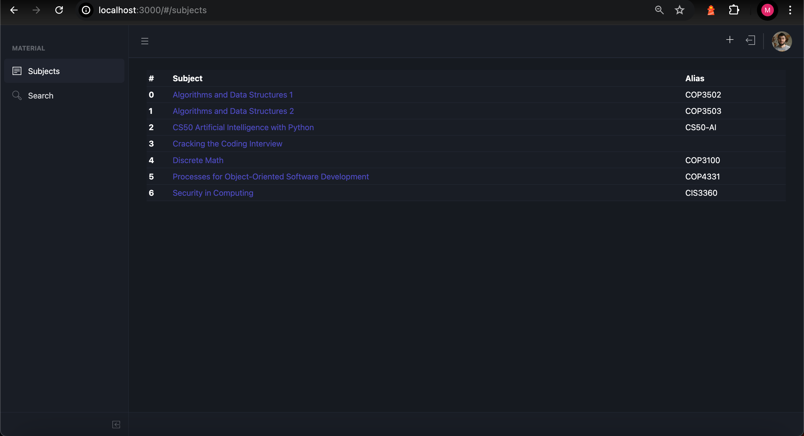
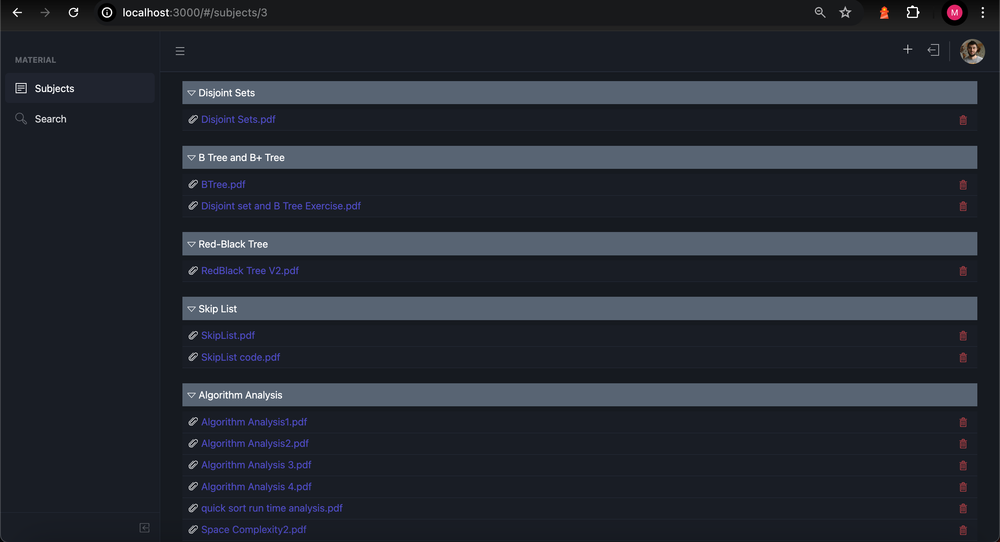
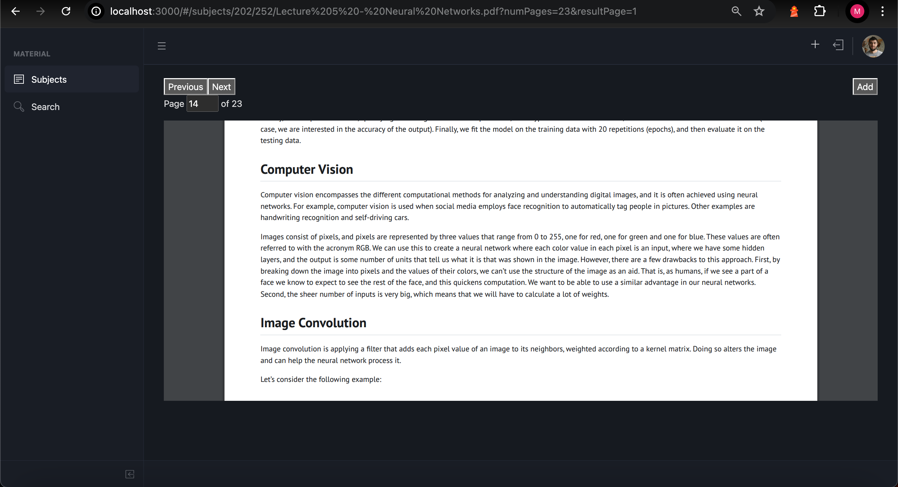
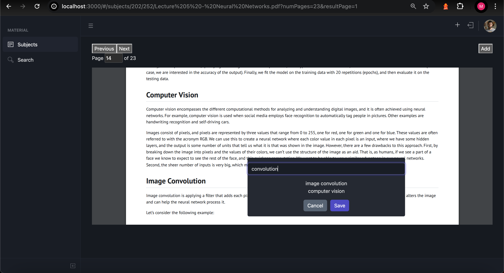
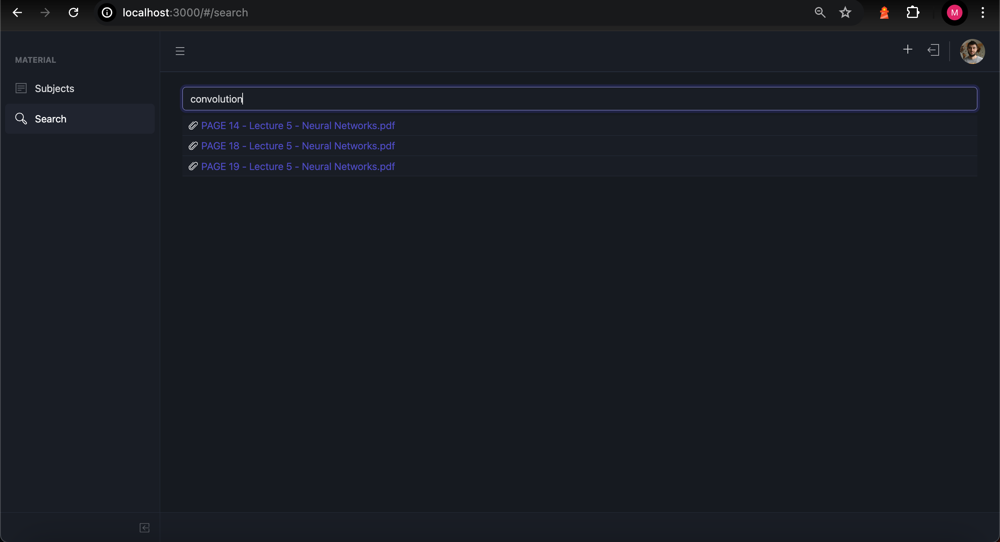

# Qvault
An app for storing educational files with a focus on easy retrieval and lookup of knowledge.
## Demo

*Subject folders*

*Subject selected*

*Viewing a file*

*Adding a tag to a file (page specific)*

*Looking-up by tags (Tag remembers and opens the correct page)*
